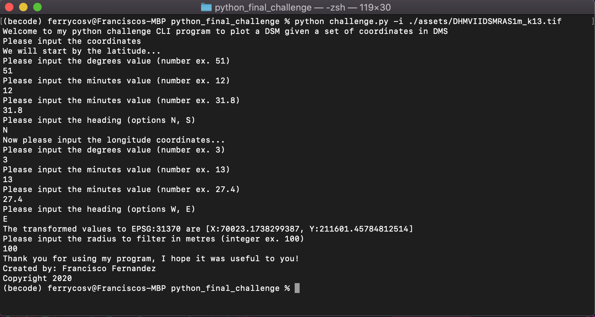

# Python final challenge
> `Challenge` solo project to read and extract data from GeoTiff files and plot a 3D meshgrid.

## Table of contents
* [General info](#general-info)
* [Screenshots](#screenshots)
* [Technologies](#technologies)
* [Setup](#setup)
* [Features](#features)
* [Status](#status)
* [Contact](#contact)

## General info
The purpose of the challenge is to learn how to read and process information from GeoTiff files, extract a part of a big raster file and convert the data to a pandas DataFrame and show a 3D meshgrid of the area filtered. 

## Screenshots

## Technologies

* Python programming language
* Plotly
* dms2dec
* georasters
* pyproj

## Setup
You can clone or fork this repository and test the files, you must provide the GeoTiff file to read from.

## Features
The challenge features are as follow:

1. CLI program that accepts as argument a GeoTiff file
2. User interaction to request the coordinates of interest
3. Parse the input coordinates on WGS84 to the projection system coordinates from the input file
4. 3D meshgrid plot of the coordinates and radius parameters given 

TODO:

1. Validate type and range of input parameters.

## Status
Challenge is: finished, final version.

## Contact
Created by [@ferrycosv](www.github.com/ferrycosv) - feel free to contact me!